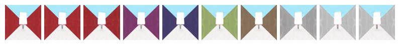
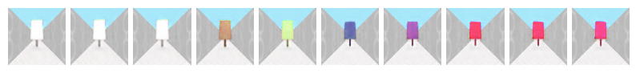
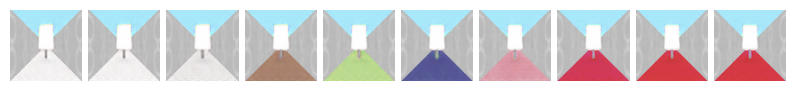
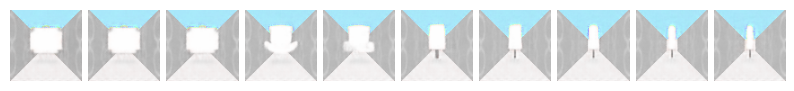
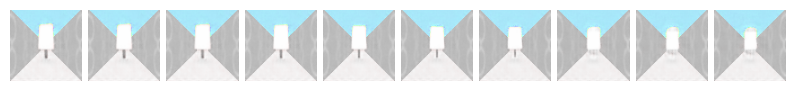

# SCAN

## About

Replicating SCAN algorithm described in Google Deep Mind's paper ["SCAN: Learning Abstract Hierarchical Compositional Visual Concepts"](https://arxiv.org/abs/1707.03389)


Image datasets are created with [Rodent envrironment. ](https://github.com/miyosuda/rodent/tree/master/examples/04_texture_replace)

## Requirements

- Tensorflow 1.2 or later
- Python2 or 3


## How to train

First extract dataset, and then run `main.py`

```
$ tar xvf data.tar.gz
$ python main.py
```

## Result

### βVAE disentanglement

 Wall color

 Obj color

 Floor color

 Obj Type

 Obj pos (and Obj Type)

